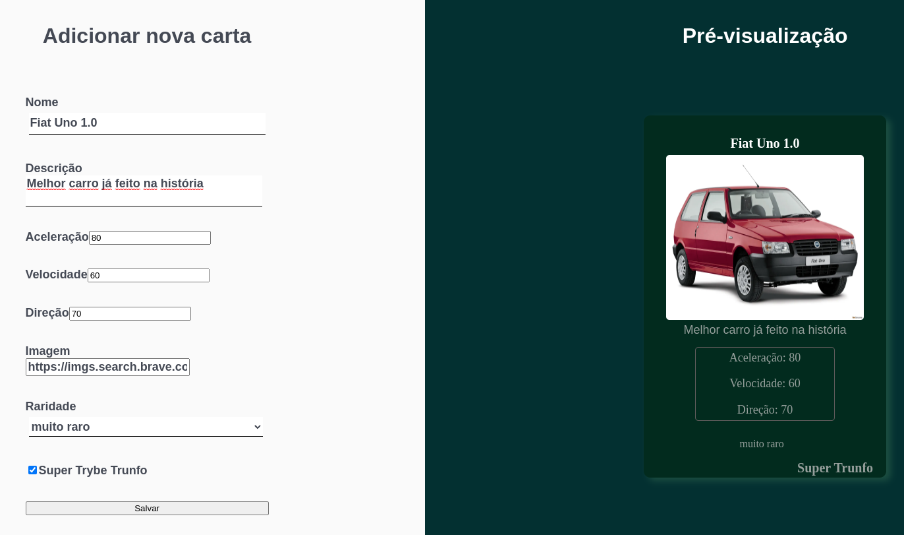

# Tryunfo

This project was developed during the web development course at [Trybe](https://www.betrybe.com/).
The project is a front end application inspired by the Super Trunfo cards game where the user can create his onw car theme cards.



## Installation

Clone this repository
```bash
git clone git@github.com:VitorCorrea18/project-tryunfo.git
```
In the project's folder install the dependencies
```bash
npm install
```
Start the project
```bash
npm start
```

Now it should be running on your default browser

## Usage
<strong>Create a card</strong>

>Fill the form with the information:
>- Nome: card name
>- Descrição: Card description
>- Aceleração: Car acceleration
>- Velocidade: Car speed
>- Direção: Direction or mmaneuverability
>- Image: Enter an image url from anywhere in the internet
>- Raridade: Card rarity
>- Super Trunfo: If this card is the super trunfo check this option

<strong>After filling the form you must click 'Salvar' button to save.</strong> <br>

You can see the saved cards scrolling down, where you can filter by card's name rarity and Super Trufo


## Obervations
  The project could not be completed 100% in the time i had, as there were much more to study and projects to be carried out,
  so some features were never implemented. With time maybe i can go back to review this and add all the feats i had in mind but for now I'll leave a list with
  the features that were not implemented:
  
  - Filter by <strong>Rarity</strong> <br>
  - Filter by <strong>Super Trunfo</strong>
